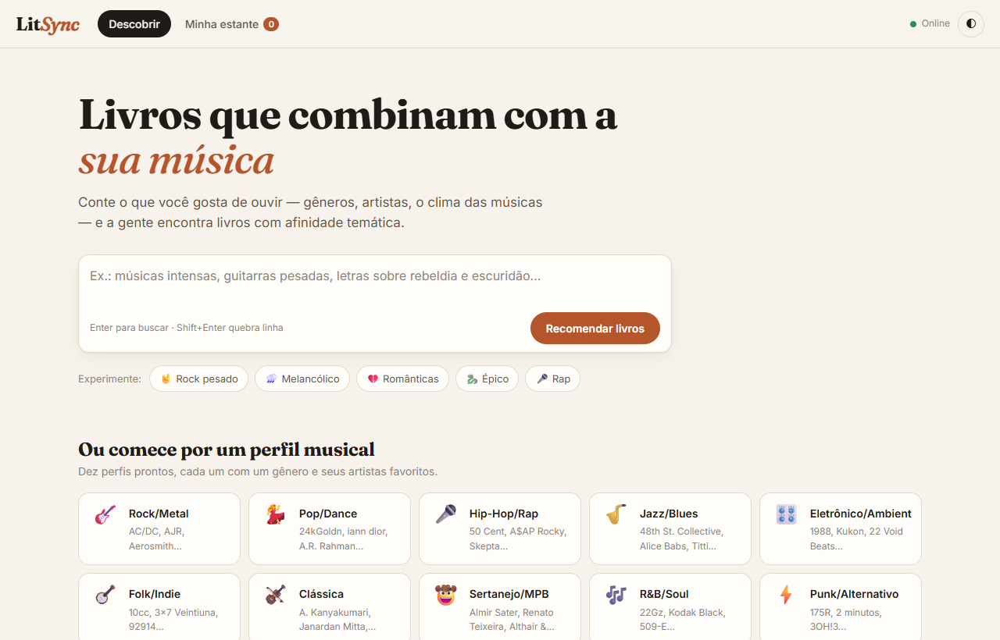
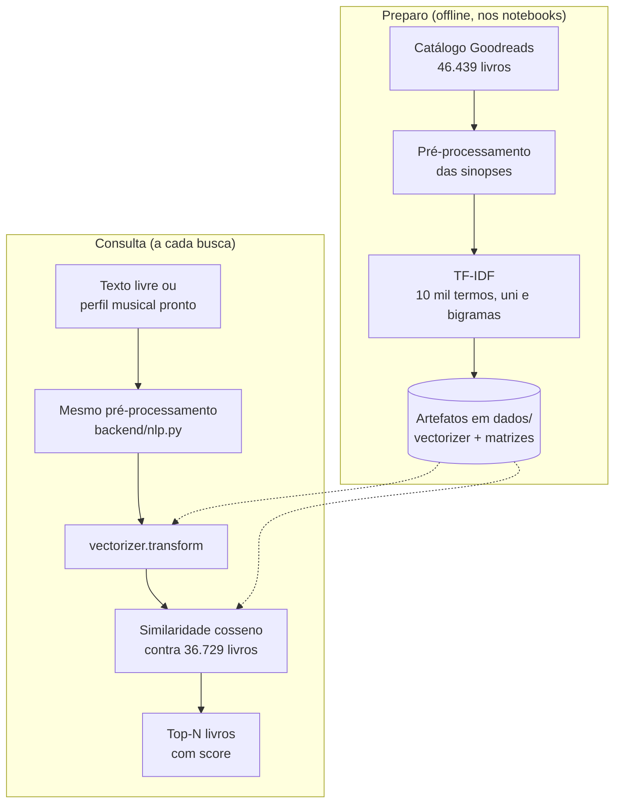
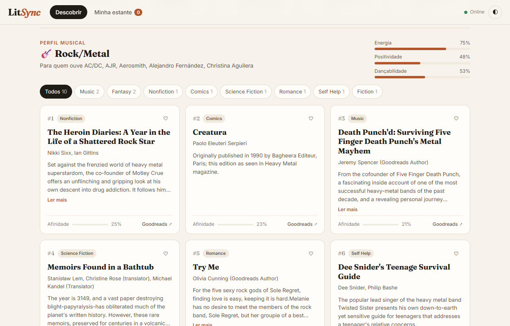

# LitSync — Recomendação de livros por perfil musical

Sistema que recomenda livros a partir do gosto musical de uma pessoa,
comparando a descrição do que ela ouve com as sinopses de um catálogo do
Goodreads por TF-IDF e similaridade cosseno.

**App no ar:**
[christian-valino.github.io/litsync-recomendacao-livros](https://christian-valino.github.io/litsync-recomendacao-livros/)

> A API fica no plano gratuito do Render, que hiberna o serviço depois de um
> período sem acesso. Na primeira visita o site mostra "Acordando o servidor"
> e pode levar cerca de 1 minuto (63 s na última medição) até responder. Depois
> disso as buscas são imediatas.



## Problema

Recomendação de livros costuma partir de outros livros: quem leu X também
leu Y. Isso não ajuda quem lê pouco, ou quem quer sair do gênero de sempre,
mas sabe muito bem do que gosta em outra mídia. Gosto musical carrega
informação parecida — clima, intensidade, temas, época — e é algo que as
pessoas descrevem com facilidade.

O LitSync testa essa ponte usando só Processamento de Linguagem Natural: o
perfil musical vira texto, as sinopses viram texto, e a recomendação é o
quanto um se parece com o outro no espaço vetorial.

## Como funciona



### As etapas

**1. Catálogo** — 46.439 livros do Goodreads (via Kaggle), com título, autor,
tema e sinopse ([dados/intermediarios/catalogo_livros.csv](dados/intermediarios/catalogo_livros.csv)).
Depois do tratamento nos notebooks ficam **36.729 livros indexados**, em 361
temas ([dados/livros_processados.csv](dados/livros_processados.csv)).

**2. Pré-processamento** ([backend/nlp.py](backend/nlp.py)) — minúsculas,
remoção de pontuação e números (preservando acentos), tokenização com NLTK,
remoção de stopwords em português e inglês, descarte de tokens com menos de 3
letras e stemming com o RSLP. A mesma função é aplicada às sinopses e ao texto
da busca: numa amostra de 300 livros, a saída da API é idêntica à sinopse
processada que foi indexada.

**3. Vetorização** — `TfidfVectorizer` com `max_features=10000`, `min_df=2`,
`ngram_range=(1, 2)` e `sublinear_tf=True`. O vetorizador treinado e a matriz
dos livros (36.729 × 10.000, esparsa) vêm prontos em `dados/`, então a API não
precisa treinar nada ao subir.

**4. Perfis musicais** — 10 perfis de exemplo, um por gênero
([dados/perfis_musicais.csv](dados/perfis_musicais.csv)). Cada um tem artistas
favoritos, gêneros e atributos de áudio (energia, positividade,
dançabilidade, acústica), e uma descrição em texto do tipo *"Artistas
favoritos: AC/DC, Aerosmith… Gêneros predominantes: rock, metal. Prefere
músicas intensas e com alta energia."* É essa descrição que vira vetor.

**5. Recomendação** ([backend/app.py](backend/app.py)) — calcula a
similaridade cosseno entre o vetor da consulta e todos os livros e devolve os
N maiores (padrão 10, máximo 50). A busca por perfil usa o vetor já calculado
do perfil; a busca livre pré-processa e vetoriza o texto na hora.

### A interface

O [frontend](frontend/) é HTML, CSS e JavaScript sem framework, publicado no
GitHub Pages. Além da busca e dos perfis, ele:

- espera a API acordar em vez de acusar erro, com aviso do tempo esperado;
- filtra os resultados por tema e carrega mais recomendações sob demanda;
- guarda livros na **Minha estante**, salva no `localStorage` do navegador;
- mantém a busca na URL (`?q=` ou `?perfil=`), para compartilhar o link;
- esconde resultados com afinidade zero, que aparecem quando nenhuma palavra
  da busca existe no vocabulário;
- tem tema claro e escuro e layout próprio para celular.



### API

| Método | Rota | Descrição |
|---|---|---|
| GET | `/` | Status da API |
| GET | `/stats` | Total de livros, perfis e tamanho do vocabulário |
| GET | `/perfis` | Lista os perfis musicais |
| GET | `/recomendar/<usuario>?top=10` | Top-N livros para um perfil |
| POST | `/buscar` | Top-N livros para um texto livre |

Exemplo de `POST /buscar`:

```json
{
  "texto": "Melancholic piano, rainy nights, loneliness and memories",
  "top": 10
}
```

## Stack

| Camada | Escolha |
|---|---|
| PLN | NLTK (tokenização, stopwords, stemmer RSLP) |
| Vetorização e similaridade | scikit-learn (`TfidfVectorizer`, `cosine_similarity`) |
| Dados | pandas, numpy, matrizes esparsas em pickle |
| API | Flask + flask-cors, hospedada no Render |
| Interface | HTML, CSS e JavaScript puros, hospedados no GitHub Pages |
| Deploy do front | GitHub Actions ([.github/workflows/main.yml](.github/workflows/main.yml)) |

Notas sobre as escolhas:

- **TF-IDF em vez de embeddings ou LLM:** a recomendação é inteiramente
  léxica. Isso deixa o resultado explicável — o score vem de termos em comum,
  que dá para inspecionar — e roda em CPU, sem custo por consulta.
- **Artefatos pré-calculados:** o vetorizador e as matrizes são gerados uma
  vez e carregados na inicialização ([backend/loader.py](backend/loader.py)).
  A API só faz `transform` e um produto de matriz por busca.
- **Front e API separados:** o site estático fica no GitHub Pages, que não
  hiberna, e só a API depende do Render.

## Estrutura de pastas

```
litsync-recomendacao-livros/
├── backend/
│   ├── app.py              # API Flask: rotas e cálculo de similaridade
│   ├── nlp.py              # pré-processamento (o mesmo usado nas sinopses)
│   └── loader.py           # carrega CSVs e pickles uma vez, na inicialização
├── frontend/               # site estático publicado no GitHub Pages
│   ├── index.html
│   ├── css/style.css       # tema claro/escuro e layout responsivo
│   └── js/main.js          # chamadas à API, filtros, estante, estado na URL
├── dados/
│   ├── livros_processados.csv   # 36.729 livros indexados (lido pela API)
│   ├── perfis_musicais.csv      # 10 perfis de exemplo (lido pela API)
│   ├── vectorizer.pkl           # TfidfVectorizer treinado
│   ├── matriz_livros.pkl        # matriz TF-IDF dos livros
│   ├── matriz_perfis.pkl        # matriz TF-IDF dos perfis
│   └── intermediarios/          # saídas dos notebooks, não lidas pela API
│       ├── catalogo_livros.csv      # catálogo bruto, 46.439 livros
│       ├── perfis_processados.csv   # perfis com o texto pré-processado
│       └── recomendacoes.csv        # top-10 de cada perfil, gerado nos notebooks
├── docs/img/               # capturas de tela deste README
├── .github/workflows/
│   └── main.yml            # publica frontend/ no GitHub Pages a cada push na main
├── requirements.txt
└── start.bat               # sobe API e frontend localmente no Windows
```

## Como rodar

Requisitos: Python 3.10 a 3.12. O `numpy==1.26.4` fixado no
`requirements.txt` não tem suporte ao Python 3.13.

### 1. Clonar o repositório

```bash
git clone https://github.com/Christian-valino/litsync-recomendacao-livros.git
cd litsync-recomendacao-livros
```

### 2. Criar o ambiente virtual e instalar as dependências

Linux / macOS:

```bash
python -m venv .venv
source .venv/bin/activate
pip install -r requirements.txt
```

Windows (PowerShell):

```powershell
python -m venv .venv
.venv\Scripts\Activate.ps1
pip install -r requirements.txt
```

> Mantenha o `scikit-learn==1.6.1`. Os pickles em `dados/` foram gerados com
> essa versão; com outra, o scikit-learn emite `InconsistentVersionWarning` e
> não garante o mesmo resultado.

Na primeira execução o NLTK baixa sozinho os pacotes `stopwords`, `punkt`,
`punkt_tab` e `rslp`.

### 3. Subir a API

```bash
python backend/app.py
```

A API sobe em `http://localhost:5000`. Leva alguns segundos para carregar os
artefatos.

> No Windows, se a saída do terminal for redirecionada para arquivo, a API
> quebra com `UnicodeEncodeError` ao imprimir o emoji do log de carga. Defina
> `PYTHONIOENCODING=utf-8` antes de rodar.

### 4. Abrir o frontend

Em outro terminal, na raiz do projeto:

```bash
python -m http.server 8080
```

Acesse `http://localhost:8080/frontend/index.html`. Aberto em `localhost`, o
frontend usa a API local automaticamente; em qualquer outro endereço, usa a do
Render.

### Atalho no Windows

O [start.bat](start.bat) faz os passos 3 e 4 em duas janelas e abre o
navegador.

## Deploy

- **Frontend:** cada push na `main` dispara o workflow
  [main.yml](.github/workflows/main.yml), que publica a pasta `frontend/` no
  GitHub Pages.
- **API:** hospedada no Render em
  `https://litsync-recomendacao-livros.onrender.com`. O comando de start fica
  configurado no painel do Render, não neste repositório — por isso mudar o
  caminho de `backend/` ou dos arquivos lidos em `dados/` exige ajustar o
  Render junto.

## Limitações e próximos passos

- **A recomendação é léxica.** Só pontua quem compartilha termos com a busca;
  sinônimos e ideias parecidas com palavras diferentes não se encontram. Em
  teste, *"Gosto de músicas intensas com guitarras pesadas como Metallica e
  Tool"* trouxe *The Lean Six SIGMA Pocket Toolbook* no top-3, porque casou
  "tool". Embeddings de sentenças resolveriam boa parte disso.
- **Buscas em português rendem menos.** A maioria das sinopses do catálogo
  está em inglês, então o vocabulário do TF-IDF também. A interface avisa e
  os exemplos prontos estão em inglês.
- **O stemmer em inglês nunca é usado.** [backend/nlp.py](backend/nlp.py)
  tenta o RSLP e só cai no Snowball em caso de exceção, mas o RSLP não lança
  exceção com palavras em inglês — ele as corta como se fossem portuguesas
  ("books" → "bok", "guitars" → "guit"). Como o mesmo corte vale para
  sinopses e buscas, não há descompasso, mas os radicais ficam piores do que
  poderiam. Corrigir exige detectar o idioma e regerar os artefatos.
- **Os atributos de áudio não entram no cálculo.** Energia, positividade e
  dançabilidade são exibidos na tela, mas a similaridade usa só a descrição
  em texto do perfil; os números influenciam apenas pela frase fixa que
  descreve a energia.
- **Os notebooks não estão no repositório.** Não é possível reproduzir a
  geração de `dados/` a partir daqui, nem documentar o critério que reduziu o
  catálogo de 46.439 para 36.729 livros.
- **Não há avaliação quantitativa.** Não existe métrica como precision@k ou
  avaliação com usuários; `recomendacoes.csv` é só a saída do modelo para os
  10 perfis. A qualidade hoje é julgada olhando os resultados.
- **Perfis com dados sujos.** As listas de artistas têm nomes repetidos e
  erros de codificação vindos da origem. O frontend remove as repetições na
  exibição, mas os arquivos continuam como estão.
- **Sem testes automatizados.** O código é validado executando a API e usando
  a interface.

## Autores

**Bruno Silva** — Ciência de Dados, Fatec Cotia
[linkedin.com/in/brunosilva09](https://linkedin.com/in/brunosilva09)

**Christian Valino**
[github.com/Christian-valino](https://github.com/Christian-valino)

Projeto desenvolvido para a disciplina de Processamento de Linguagem Natural.
